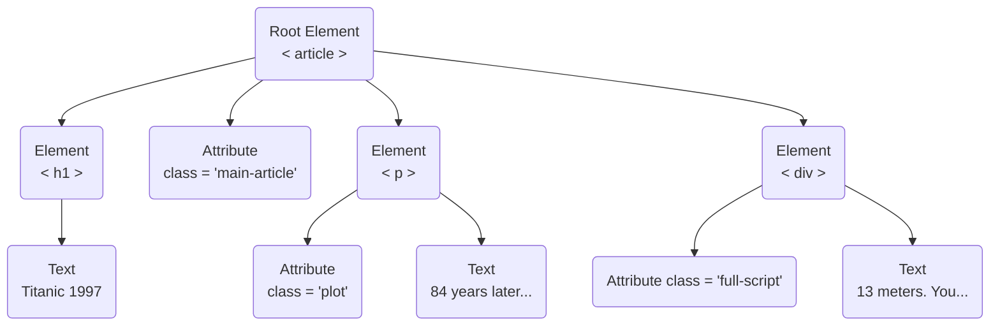

```mermaid
graph TD
    A(Root Element <br> < article >) --> B0(Element <br> < h1 >)
    A --> B1(Attribute <br> class = 'main-article')
    A --> B2(Element <br> < p >)
    A --> B3(Element <br> < div >)

    B0 --> C1( Text <br> Titanic 1997)

    B2 --> C2( Attribute <br> class = 'plot')
    B2 --> C3(Text <br> 84 years later...)

    B3 --> C4( Attribute class = 'full-script')
    B3 --> C5( Text <br> 13 meters. You...)
```

It's recommended to find elements in this order
1. ID
2. Class name
3. Tag name, CSS selection
4. Xpath